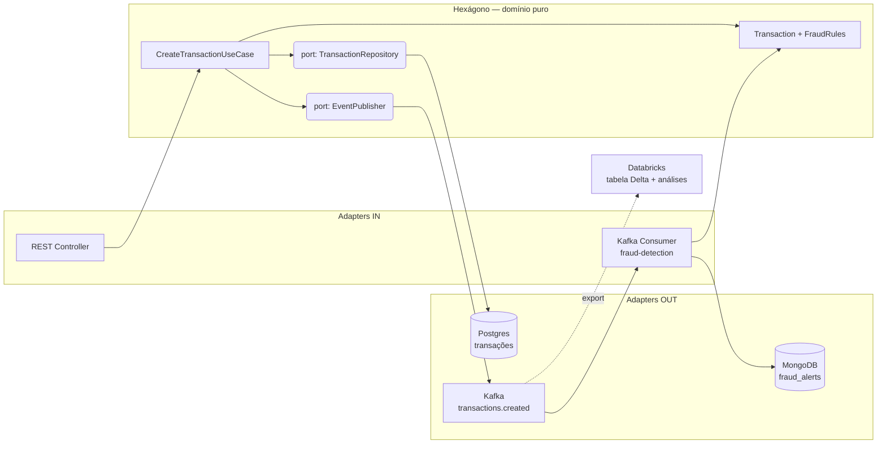
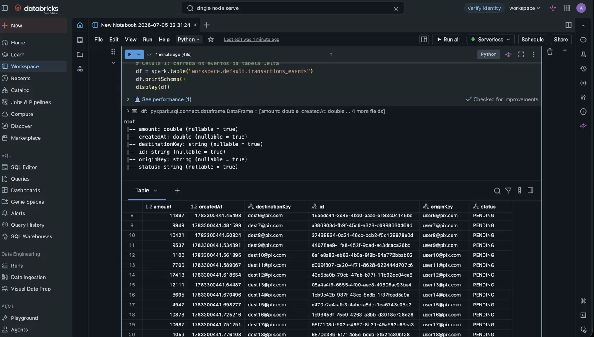
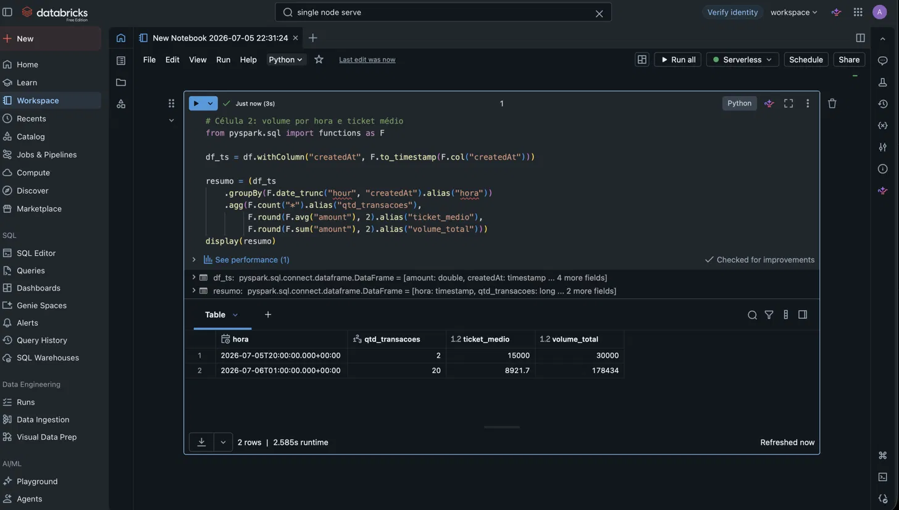
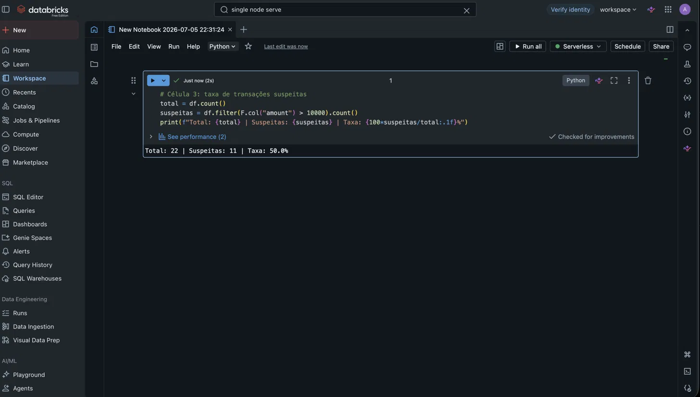

# PixFlow 💸

Sistema de processamento de transações Pix com detecção de fraude em tempo real, construído para demonstrar **arquitetura hexagonal**, **mensageria com Kafka**, **persistência poliglota** e integração com **camada analítica**.

**Stack:** Java 21 · Spring Boot 3 · Apache Kafka · PostgreSQL · MongoDB · Databricks · GitHub Actions

[](https://github.com/JaymeCaironi/pixflow/actions/workflows/ci.yml)

---

## Arquitetura



**Fluxo:** `POST /api/v1/transactions` → validação no domínio → persistência no Postgres → evento publicado em `transactions.created` → consumer de fraude avalia as regras de negócio → transações suspeitas geram alerta no MongoDB → eventos exportados alimentam a análise no Databricks.

---

## Decisões de arquitetura

### Hexagonal (ports & adapters)

O domínio (`Transaction`, `FraudRule`) é **Java puro** — zero dependência de Spring, JPA ou Kafka. O mundo externo se conecta por interfaces (*ports*) implementadas por *adapters*. A montagem dos beans é feita via `@Configuration`/`@Bean` fora do hexágono, mantendo o framework como detalhe de infraestrutura.

Prova prática durante o desenvolvimento: o repositório começou **em memória** e foi trocado por **Postgres** — e o MongoDB foi adicionado depois — **sem alterar uma linha do domínio ou do caso de uso**. Apenas adapters entraram e saíram.

### Persistência poliglota

| Banco | Papel | Por quê |
|---|---|---|
| **PostgreSQL** | Registro transacional (a "verdade") | Dinheiro exige ACID, integridade referencial e schema rígido |
| **MongoDB** | Alertas de fraude | Documentos com formato variável por regra, consultas flexíveis |

Cada dado no banco com as garantias que ele precisa.

### Domínio imutável

`Transaction` é um **record do Java 21**: mudanças de estado geram novas instâncias (`withStatus`). O **construtor compacto** valida as invariantes na criação — não existe transação inválida no sistema (*making illegal states unrepresentable*). Valores monetários usam `BigDecimal`, nunca `double`.

### Event-driven

- A key das mensagens Kafka é o **id da transação** → mensagens da mesma transação caem na mesma partição, garantindo ordem.
- Publicação **assíncrona** (`CompletableFuture`) — a requisição HTTP não bloqueia esperando o broker.
- Regras de fraude seguem o **Strategy pattern**: o consumer recebe `List<FraudRule>` por injeção; adicionar uma regra nova = criar uma classe nova, sem tocar nas existentes (Open/Closed).
- Kafka em modo **KRaft** (sem ZooKeeper).

### CI com GitHub Actions

Build + testes de domínio a cada push na `main`, com cache das dependências Maven. Os testes de domínio rodam em milissegundos por não dependerem de Spring nem de infraestrutura.

---

## Como rodar

**Pré-requisitos:** Java 21, Docker (ou Colima) e Docker Compose.

```bash
# 1. Sobe a infraestrutura: Postgres + Kafka (KRaft) + MongoDB
docker compose up -d

# 2. Sobe a aplicação
./mvnw spring-boot:run
```

### Criar uma transação

```bash
curl -X POST http://localhost:8080/api/v1/transactions \
  -H "Content-Type: application/json" \
  -d '{"originKey":"a@pix.com","destinationKey":"b@pix.com","amount":250.00}'
```

### Disparar a detecção de fraude

Valores acima de R$ 10.000 acionam a `HighAmountRule`:

```bash
curl -X POST http://localhost:8080/api/v1/transactions \
  -H "Content-Type: application/json" \
  -d '{"originKey":"a@pix.com","destinationKey":"b@pix.com","amount":15000.00}'
```

### Verificar os resultados

```bash
# Transações gravadas no Postgres
docker compose exec postgres psql -U pixflow -d pixflow \
  -c "SELECT id, origin_key, amount, status FROM transactions;"

# Alertas de fraude no MongoDB
docker compose exec mongodb mongosh --quiet pixflow \
  --eval 'db.fraud_alerts.find().pretty()'
```

### Rodar os testes

```bash
./mvnw test
```

---

## Análise no Databricks

Os eventos do tópico `transactions.created` são exportados e carregados em uma **tabela Delta** no Databricks, onde um notebook PySpark calcula:

- **Volume de transações por hora** e ticket médio
- **Taxa de transações suspeitas** (acima do limite da regra de fraude)

<!-- Substitua pelos seus screenshots -->




Em produção, essa ponte seria um conector gerenciado (Kafka Connect / Delta Live Tables) gravando incrementalmente em Delta Lake — o notebook reproduz o conceito da arquitetura *lakehouse*: sistemas OLTP emitem eventos que alimentam a camada OLAP.

---

## Estrutura do projeto

```
src/main/java/com/jaymecaironi/pixflow/
├── domain/                  # Java puro — nenhuma dependência de framework
│   ├── model/               # Transaction (record), TransactionStatus
│   └── service/             # FraudRule (interface), HighAmountRule
├── application/
│   ├── port/in/             # CreateTransactionUseCase
│   ├── port/out/            # TransactionRepository, TransactionEventPublisher
│   └── CreateTransactionService
├── adapter/
│   ├── in/rest/             # Controller + DTOs (fronteira da API)
│   ├── in/kafka/            # FraudDetectionConsumer
│   ├── out/persistence/     # Adapter JPA/Postgres
│   ├── out/kafka/           # Producer Kafka
│   └── out/mongo/           # Alertas de fraude
└── config/                  # Montagem dos beans (@Configuration)
```

---

## Evoluções mapeadas

- **Testcontainers** — testes de integração com Postgres e Kafka efêmeros
- **Flyway** — migrations versionadas substituindo `ddl-auto`
- **Schema Registry + Avro** — contrato de eventos versionado no lugar de JSON
- **Dead Letter Queue** — tratamento de mensagens com falha no consumer
- **Padrão Outbox** — atomicidade entre gravação no banco e publicação do evento
- **Novas regras de fraude** — frequência por origem, horário atípico, destino recorrente

---

## Autor

**Jayme Caironi** — [github.com/JaymeCaironi](https://github.com/JaymeCaironi)
